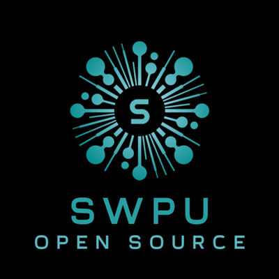

# 西南石油大学开源协会

| [中文](README.md) | [English](README.en_US.md) |
| ----------------- | -------------------------- |

---

## 介绍

西南石油大学开源协会（The Open Source Association affiliated with SWPU）是由西南石油大学学生自发组建的开源社区，致力于弘扬自由软件运动精神、推广开源软件、开展开源项目、促进开源社区发展。协会的主要活动有：举办开源沙龙、举办开源会议、举办开源培训、举办开源比赛、推广开源软件、参与开源项目开发、分享开源经验、组织开源活动等。

## 组织架构

- 理事会：协会的管理机构，成员由核心贡献者中选举产生，负责协会的一切工作，包括组织会议、举办活动、管理协会资源、管理协会事务。
- 宣发委员会：由协会会员中产生，对理事会负责。宣发委员会负责协会的宣传推广、宣传活动、宣传策略，同时负责与校企进行对接合作。
- 核心开发者：协会的核心贡献者由协会贡献者中产生，负责协会的开源工程项目的开发、维护、运营等工作。
- 贡献者：为协会和协会相关的项目进行贡献并被合并的开发者，长期参与协会的开发工作的贡献者会得到理事提名，选举后成为核心开发者。
- 会员：协会的正式成员由学生自发加入，参与协会开源社区的日常活动，并有机会获得协会的各种奖励。

## 参与贡献

在参与贡献之前，请先阅读[行为准则](CODE_OF_CONDUCT.md)和[贡献指南](CONTRIBUTING.md)。

## 加入我们

欢迎加入西南石油大学开源协会，一起推动开源社区的发展！

- 加入招新 QQ 群：940185806

    

- 加入 GitHub 组织：https://github.com/SWPUOpenSource
